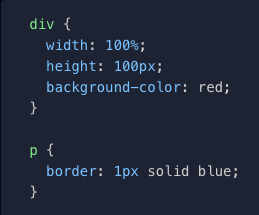
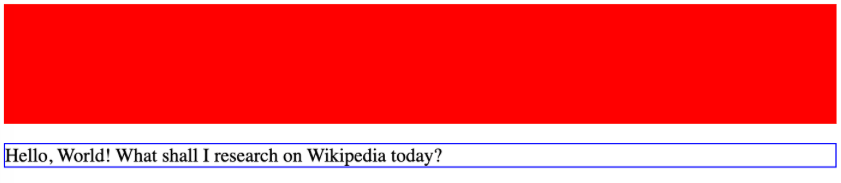
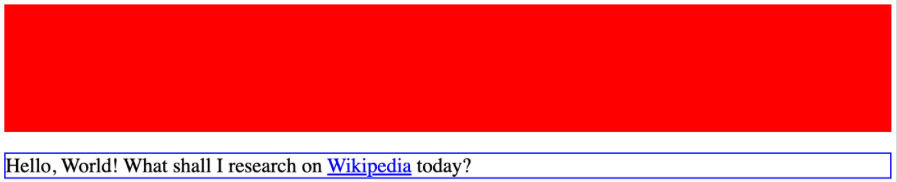

# Practice: Creating a Webpage building upon HTML basics and understanding how to use CSS Basics

## Understanding selectors and properties to bring styling with colors, fonts, sizing, layouts, and much more...

### Practce understanding CSS -> Displaying Elements

-   [ ] Simple practice to gain a better understanding of the power of adding CSS Styling to a webpage and how it can make it uniquely beautiful
    -   [ ] CSS or Cascading Style Sheet, is a language that paints a website with colors, fonts, layouts, and animations.
    -   [ ] CSS is used to create stunning webpages.
    -   [ ] It can enhance the user experience, and can make a webpage unquie and stand out amongst the rest.
    -   [ ] It is absolutely beautiful to see a webpage come to life and become even more beautiful.

-   [ ] CSS - Displaying Elements:
    -   [ ] If a web page were like a piece of lined notebook paper and the elements were what you wrote on the page:
        -   [ ] Some elements would be written on their own line.
        -   [ ] Other elements would be able to share a line with other elements.
        -   [ ] Elements are either displayed on the block level or the inline level.
    -   [ ] <b>Block</b> elements take up the entire "width" of whatever they're inside of. However, this can be changed (as well as the "height").
        -   [ ] Block elements by default take are rendered on their own line by themselves. i.e. a &lt;div&gt; or &lt;p&gt; element.
        -   [ ] For instance:
            -   [ ] 
            -   [ ] The &lt;div&gt; block element now has a defined "width" and "height", as well as a "background-color". Since it is rendered before the &lt;p&gt; paragraph element, the page will render like below:
                -   [ ] 
    -   [ ] <b>Inline</b> elements only take up as much space as needed, and other elements may appear beside them. i.e. the &lt;a&gt; anchor element is a very popular inline element because links are always being used within blocks of text
        -   [ ] 
        -   [ ] Unlike the block elements, inline elements cannot change their "width" or "height" properties.
    -   [ ] There is another property called "inline-block"
        -   [ ] The syntax -> display: inline-block"
            -   [ ] It can share the same line with other inline elements
            -   [ ] Despite being inline, its widthe and height can be changed

-   [ ] The &lt;header&gt; element:
    -   [ ] Is used for the beginning of the webpage
    -   [ ] Houses the title of the webpage along with Logos
    -   [ ] The &lt;figure&gt; element:
        -   [ ] Usually holds an image, illustration, diagram, code snippets, etc...
        -   [ ] It can also hold more than one
    -   [ ] The &lt;img&gt; element:
        -   [ ] Is used for all the images on the webpage

-   [ ] The &lt;nav&gt; element:
    -   [ ] This element tends to contain ordered lists, unordered lists, or even both types of lists
    -   [ ] Each &lt;li&gt; element will house an &lt;a&gt; elements with the #id-name of the desired section or part of the webpage it will be linked within the "href" attribute
        -   [ ] For instance:
            -   [ ] &lt;a href="#desired-section"&gt;🌸 Desired Section🌸&lt;/a&gt;
            -   [ ] <a href="#desired-section">🌸 Desired Section 🌸</a>
                -   [ ] When the user would click the 🌸 Desired Section 🌸 link they would then be navigated to that section of the webpage

-   [ ] The &lt;br&gt; element:
    -   [ ] Creates a new line in your code and forces whatever comes after to start on a new lin

-   [ ] The &lt;hr&gt; element:
    -   [ ] Adds a horizontal line or dividing line across the webpage
    -   [ ] Used to separate sections or different topics on a webpage

-   [ ] The &lt;main&gt; element:
    -   [ ] Is where the main information of the webpage will go
    -   [ ] The &lt;section&gt; element:
        -   [ ] This groups together pieces of similar information
    -   [ ] The &lt;article&gt; element:
        -   [ ] This will house a singular piece of information describing what this section is about in great detail

-   [ ]  The &lt;footer&gt; element:
    -   [ ]  This element tends to finish off the webpage as it is located at the very bottom of the webpage and is the last set of items that will be seen
    -   [ ] For instance:
        -   [ ] A footnote on the webpage
        -   [ ] Links to different sections of the webpage
        -   [ ] A copyright symbol for copyright information
            -   [ ] & copy; -> is the symbol for copyright
        -   [ ] A link to external sources using the "href" attribute of the &lt;a&gt; element for the links in the list item to external sources
            -   [ ] &lt;a href="/privacy"&gt;Privacy&lt;/a&gt;
                -   [ ] Use the target attribute to open the link path in a new tab instead of the current page
                -   [ ] <a href="/privacy" target="_blank">Privacy</a>
                -   [ ] When the user clicks one of these external links, they would be redirected to a new page with the informat ion

-   [ ] Encompassed Technologies:
    -   [ ] HTML
    -   [ ] CSS
-   [ ] HTML:
    -   [ ] Will be the structure and skeleton of how the app will appear on the webpageWill be the structure and skeleton of how the app will appear on the webpage
-   [ ] CSS:
    -   [ ] Encompass the style of the app and give it some flair

-   [ ] Link to visit the webpage:
    -   [ ] <a href="https://rlb-local-library.netlify.app/" target="_blank">rlb-local-library</a>
